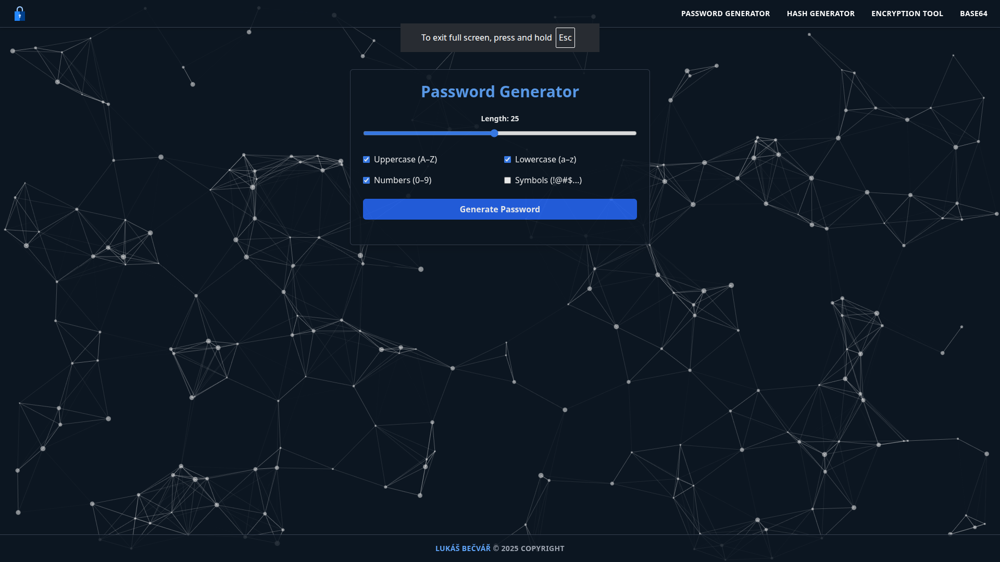
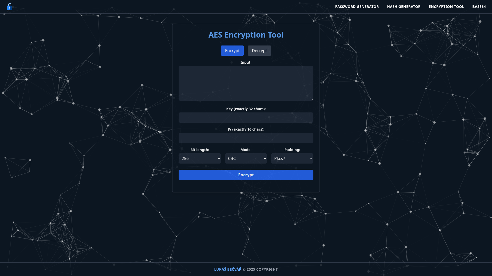

# password and hash generator
A simple password generator and hashing tool available as a web and Electron app.

# Preview
## Password Generator

## Encryption Tool

# Environment
The entire NPM/Node stack is running in Docker for complete development independence, and the app build is a basic React app & Docker image with Nginx web server or for a desktop Electron application.

# Installation
## Web
1. Download the latest build from github releases.
2. Extract the zip file.
3. Put the extracted files to yout web server.

## Desktop
1. Download the latest build from github releases.
2. Run the app with executable app image.

## Docker
1. Pull latest docker image from github packages.
2. Run the docker image with `docker run -p 80:80 ghcr.io/lukasbecvar/password-and-hash-generator:latest`.
3. Access the app on http://localhost:80

## Dependencies
* Electron
    * [Website](https://www.electronjs.org)
* Node.js
    * [Website](https://nodejs.org)
* React
    * [Website](https://reactjs.org)
* Tailwind CSS
    * [Website](https://tailwindcss.com)
* TsParticles
    * [Website](https://particles.js.org)
* CryptoJS
    * [Website](https://cryptojs.gitbook.io/docs)

## License
This software is licensed under the [MIT license](LICENSE).
